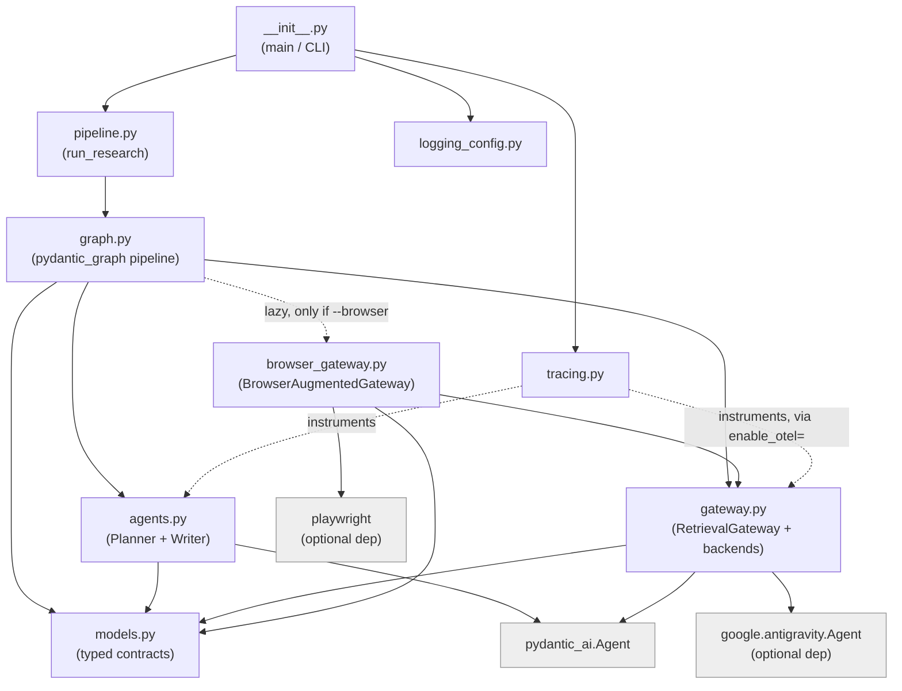
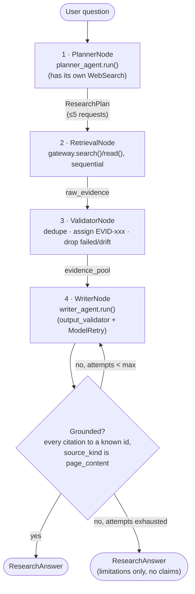
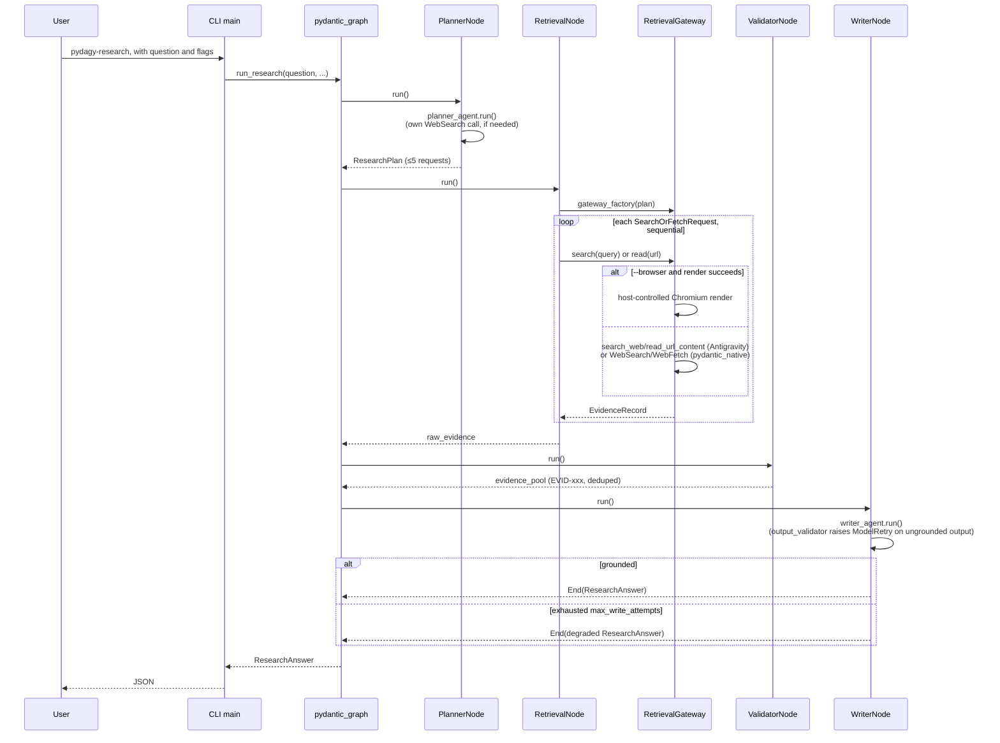
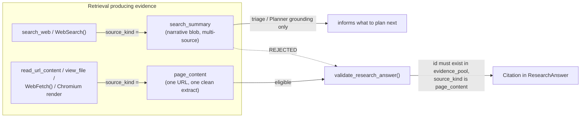
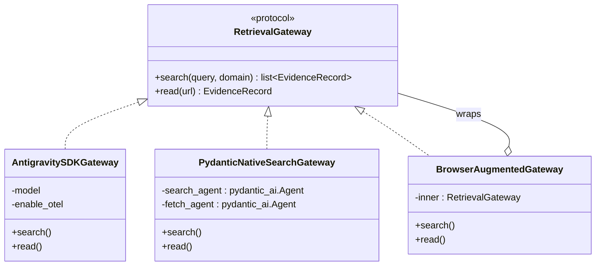
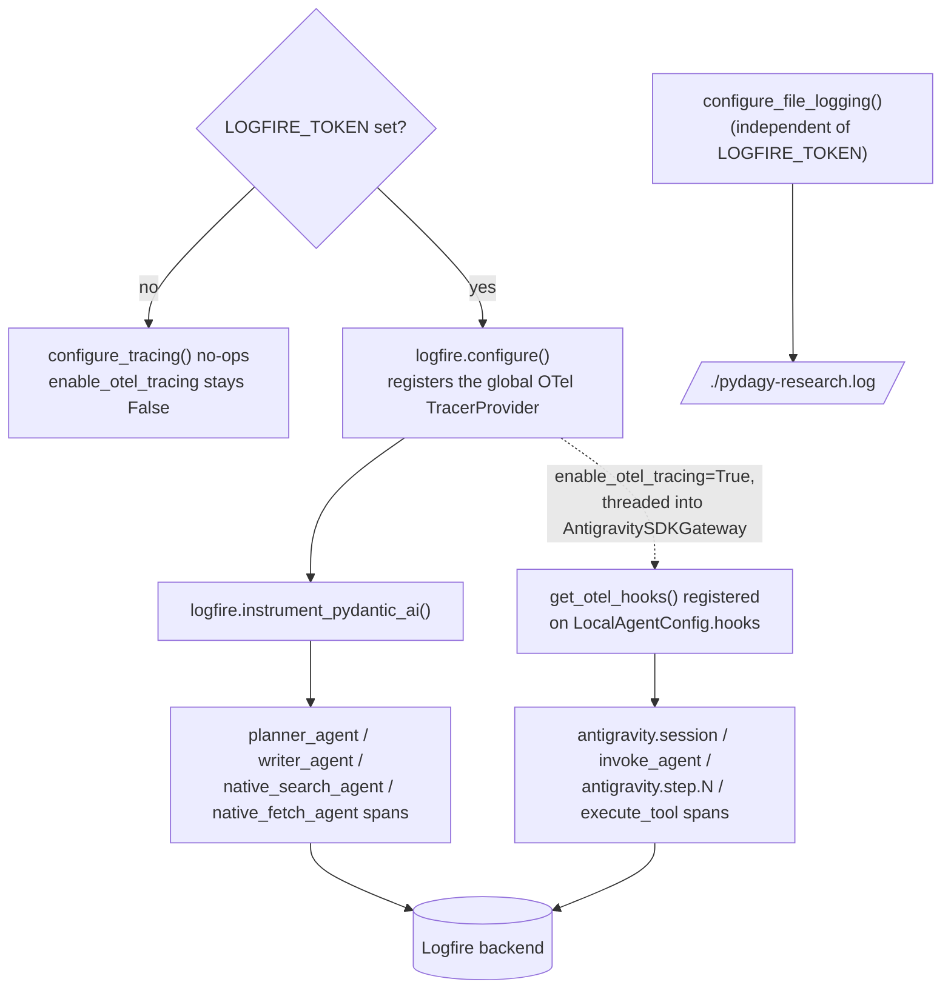

# Architecture

This document describes the system as built in `src/pydagy_research/` —
components, data flow, requirements/constraints, and assumptions. It is the
as-built reference; [`PLAN.md`](PLAN.md) is the original design rationale,
and [`FINDINGS.md`](FINDINGS.md) is the empirical record of what live
testing confirmed, broke, or changed about that design. Where this document
and PLAN.md disagree, this document reflects what the code actually does
today, with a note pointing at the finding that caused the divergence.

## 1. Overview

A Pydantic AI research pipeline that answers a question by retrieving real
web evidence and writing a grounded answer, where every citation is
mechanically verified to (a) exist in the actual retrieved evidence and (b)
rest on a full page read rather than a search-result summary. Retrieval runs
behind a swappable gateway — the Google Antigravity SDK (a sandboxed,
subprocess-mediated agent) or Pydantic AI's own native web search/fetch —
optionally augmented with a real headless-Chromium fetch for JavaScript-
rendered pages. Orchestration is a small `pydantic_graph` state machine;
Pydantic AI owns all model reasoning (planning and writing).

## 2. Components

| Module | Responsibility |
|---|---|
| `models.py` | Typed contracts (`ResearchPlan`, `EvidenceRecord`, `Claim`, `Citation`, `ResearchAnswer`) and `validate_research_answer()`, the runtime evidence-grounding check. No SDK dependency. |
| `agents.py` | `pydantic_ai` factories for the Planner (`build_planner_agent`) and Writer (`build_writer_agent`) agents, their system prompts, and `WriterDeps`. |
| `gateway.py` | The `RetrievalGateway` protocol and its two backend implementations, `AntigravitySDKGateway` and `PydanticNativeSearchGateway`, plus `make_gateway()` (backend selection) and `run_plan()` (sequential plan execution). |
| `browser_gateway.py` | `BrowserAugmentedGateway` — wraps either backend, replacing `.read()` with a host-controlled headless-Chromium fetch. |
| `graph.py` | The `pydantic_graph` pipeline: `PipelineState`, `PipelineDeps`, the four node classes, `build_graph()`, and `default_deps()` (real-agent convenience wiring). |
| `pipeline.py` | `run_research()` — the single top-level entrypoint tying a question + config to a `ResearchAnswer`. |
| `logging_config.py` | CLI-only: `configure_file_logging()` attaches a root-logger `FileHandler` (`./pydagy-research.log` by default). |
| `tracing.py` | CLI-only: `configure_tracing()` enables Logfire (`logfire.configure()` + `logfire.instrument_pydantic_ai()`) when `LOGFIRE_TOKEN` is set; a no-op otherwise. |
| `__init__.py` | Public API re-exports, and the `main()` CLI entrypoint (`pydagy-research` console script). |

### 2.1 Module dependencies

`models.py` has no SDK dependency at all — both backends and every graph
node speak the same typed contracts, which is what makes the backend
swappable in the first place. `google-antigravity` and `playwright` are
imported lazily inside `gateway.py`/`browser_gateway.py` methods, not at
module scope, so the package imports fine without either installed.

## 3. Data flow: the pipeline

This is the literal shape `pydantic_graph` derives from `graph.py`'s node
return-type hints and renders via `Graph.render()` — not an idealized
diagram, the actual state machine.

1. **PlannerNode** — a single `planner_agent.run()` call, host-forced to the
   configured `retrieval_backend` afterward (`plan.model_copy(update=...)`
   — the model never picks the backend). The Planner has its own `WebSearch`
   capability so it can name a real, specific URL instead of guessing (§7,
   and FINDINGS.md §1.6) — critical because the plan is generated once, in
   full, before any retrieval happens; there is no edge back from Retrieval
   to Planner.
2. **RetrievalNode** — `ctx.deps.gateway_factory(plan)` builds the gateway
   for `plan.retrieval_backend`, opened once (`async with gateway:`) and
   reused across every request in the plan, executed strictly sequentially
   (`run_plan()`).
3. **ValidatorNode** — normalizes URLs (`strip().lower()`), drops
   `status == "failed"` and `drift_flagged` records, deduplicates by
   normalized URL, and assigns stable `EVID-001`, `EVID-002`, ... ids. Does
   **not** drop `search_summary` records — only `page_content` is citable,
   but both kinds stay in the pool for the Writer to see.
4. **WriterNode** — the outer, bounded backstop around the Writer agent's
   own `output_validator` (§4). Loops back to itself up to
   `PipelineDeps.max_write_attempts` (default 2) on grounding failure, then
   degrades to a limitations-only `ResearchAnswer` rather than emitting an
   ungrounded one.

### 3.1 One run, end to end

## 4. The grounding contract

The whole point of the architecture: a citation can only exist if it points
at evidence the host actually retrieved and can independently verify as a
full page read, never a synthesized summary.

Enforced in two places, both required, checking the same thing at different
scopes:

- **`agents.build_writer_agent`'s `@agent.output_validator`** — runs inside
  the Writer's own `pydantic_ai.Agent.run()`, raises `ModelRetry` on
  violation, and `pydantic_ai` automatically re-prompts the model (fast,
  in-agent, bounded by `pydantic_ai`'s own output-retry limit).
- **`graph.WriterNode`** — the outer backstop once those in-agent retries
  are exhausted (`UnexpectedModelBehavior`); loops the whole node or
  degrades (§3).

`ResearchAnswer.@model_validator` (self-contained: citations must back a
claim within the answer itself) and `validate_research_answer()`
(needs the live `evidence_pool`, so it can't be a bare Pydantic validator —
see its docstring) are deliberately split for that reason, not duplicated
by accident.

**One narrow, explicit exception** to "typed hooks only, never model
prose": `AntigravitySDKGateway._apply_response_text_fallback` (FINDINGS.md
§3.1) falls back to the model's own final response text when
`read_url_content`/`view_file`'s structured extraction is empty or under 80
characters — because `view_file`'s hook payload structurally never carries
the viewed file's content (the SDK doesn't include it in
`_TOOL_RESULT_MODELS`), not because of a design choice on this project's
side. Mirrors the identical, PLAN.md-documented trade-off
`PydanticNativeSearchGateway` already makes when a provider's native tool
doesn't itemize sources.

## 5. Retrieval backend architecture

- **`AntigravitySDKGateway`** — a fail-closed, capability-locked
  `google.antigravity.Agent` (`SEARCH_WEB`, `READ_URL_CONTENT`, `VIEW_FILE`
  only; `deny_all()` + explicit `allow()` policies; `BudgetConfig
  (max_tool_calls=12, max_model_calls=10)`, session-scoped for the whole
  plan). Evidence is extracted via a typed `@post_tool_call` hook, never
  `response_schema`. A `@pre_tool_call_decide` hook captures the
  actually-executed `query`/`url` (lowercased — wire key casing is
  tool-specific and unnormalized) so the post-hook can flag drift against
  what was requested. `enable_otel=True` additionally wires the SDK's own
  `get_otel_hooks()` (§6).
- **`PydanticNativeSearchGateway`** — two plain `pydantic_ai.Agent`s with
  `WebSearch()`/`WebFetch()` capabilities. Per-source evidence extraction
  from `NativeToolReturnPart` content requires a recognized text field
  (`snippet`/`text`/`content`/`extract`/`body`/`summary`); a status-only
  payload (confirmed live for Google's `web_fetch`: pure retrieval
  bookkeeping, no page text) falls through to `result.output` as one opaque
  blob instead of being mistaken for real content.
- **`BrowserAugmentedGateway`** — a decorator over either backend. Launches
  one Chromium instance per session, reused across every `.read()` in the
  plan. Renders the requested URL directly (`page.goto` + `innerText`), no
  model call, no drift risk by construction. Falls back to the wrapped
  gateway's own `.read()` on render error or empty text. `.search()` is
  delegated unchanged — headless rendering isn't a search mechanism.
  **Consequence, confirmed empirically (FINDINGS.md §3):** when the render
  succeeds, both backends' own retrieval code never runs at all, so the two
  SDKs' extraction-quality difference is invisible under `--browser` — the
  backend choice then mainly affects latency, not evidence quality.

`make_gateway(plan, **kwargs)` selects the class from
`plan.retrieval_backend`; `graph.default_deps()`'s `gateway_factory`
closure is what decides *which* kwargs each backend gets (`model=` only for
`pydantic_native` — Antigravity's own model namespace is different and must
not receive the same string) and whether to wrap the result in
`BrowserAugmentedGateway`.

## 6. Observability

Two independent, composable pieces, both CLI-only (`main()` opts in; library
callers of `run_research()` don't get either unless they call the
configurators themselves):

- **File logging** (`logging_config.py`) always runs — root-logger
  `FileHandler`, append mode, level `INFO` by default. Captures this
  package's own logging plus anything else that logs through the root
  logger (which includes the raw `google.antigravity` session trace — that
  SDK logs via bare `logging.info(...)`, not a named logger).
- **Logfire tracing** (`tracing.py`) is conditional on `LOGFIRE_TOKEN`.
  `logfire.instrument_pydantic_ai()` only sees `pydantic_ai.Agent`
  internals, so it's blind to `AntigravitySDKGateway` (which never touches
  a `pydantic_ai.Agent`). `AntigravitySDKGateway(enable_otel=True)` closes
  that gap with the SDK's own `google.antigravity.utils.otel.get_otel_hooks()`
  — standard OTel spans that land in the same trace automatically, since
  `logfire.configure()` is what registered the global `TracerProvider` in
  the first place (no separate exporter wiring). `main()` threads
  `configure_tracing()`'s return value straight into
  `enable_otel_tracing=`, so setting one env var traces the whole pipeline,
  Antigravity subprocess included.

## 7. Requirements & constraints

**Runtime**: Python 3.14, managed via `uv`. Core deps: `pydantic>=2.13.4`,
`pydantic-ai>=2.32.1`, `pydantic-graph>=2.32.1`. Optional: `google-antigravity`
(`antigravity` extra — required only for that backend; the SDK ships its
own `localharness` binary, no separate install step), `playwright`
(`browser` extra — additionally needs `uv run playwright install chromium`,
a real ~95MB download).

**Auth**: `GEMINI_API_KEY` (Google AI Studio) or Vertex AI ADC/express mode
for the model provider. `LOGFIRE_TOKEN` optional, gates tracing only.
`PYDAGY_RESEARCH_LOG_FILE` / `PYDAGY_RESEARCH_LOG_LEVEL` optional, override
file-logging defaults.

**Structural constraints** (verified against SDK source and/or live traces,
not assumed):

1. **Retrieval is always LLM-mediated for the Antigravity backend.** No RPC
   exists to force `search_web(query=X)` with an exact string — a
   `SearchOrFetchRequest` becomes a prompt, and the inner model decides
   whether/how to call the tool. This is why the drift check exists at all.
2. **`search_web` returns one narrative string, not itemized sources** —
   `ActionSearchWeb` is `{query, domain, summary}`, no per-source list. This
   is why `source_kind` and the citation validator exist; without them,
   verification would depend on regex-scraping URLs out of synthesized
   prose.
3. **One Antigravity session = sequential retrieval.** `Agent.chat()` /
   `Conversation.send()` are turn-based against shared history; no
   documented support for overlapping concurrent turns on one session.
4. **`view_file`'s hook payload is never the viewed file's content**
   (FINDINGS.md §3.1) — `VIEW_FILE` isn't in the SDK's
   `_TOOL_RESULT_MODELS` mapping, so `post_tool_call` only ever receives a
   short caption string for it. No prompt fix can change this; it's a
   structural gap in what the hook receives.
5. **Wire argument-key casing is tool-specific and unnormalized** —
   `search_web` sends `{"query": ...}`, `read_url_content` sends
   `{"Url": ...}` (confirmed live). The drift check lowercases captured
   keys defensively; assuming a single casing silently broke drift
   detection for every successful read (FINDINGS.md §1.2).
6. **`Agent.__init__` deep-copies the whole `AgentConfig`, hooks included**,
   before its "keep hooks by original-object identity" step runs. Any
   object reachable from a hook's bound `self` must be deep-copy-safe — a
   cached live module reference broke this (FINDINGS.md §1.1).
7. **`ResearchPlan` is generated once, in full, before any retrieval
   happens.** There is no back-edge from `RetrievalNode` to `PlannerNode`
   in the graph. A wrong `read` target guessed at plan time cannot be
   corrected downstream by a better `read()` prompt, better rendering, or
   anything else — it has to be fixed before the plan is finalized
   (FINDINGS.md §1.6), which is why the Planner has its own `WebSearch`.
8. **`TestModel` raises `UserError` for any configured capability**,
   invoked or not — `build_planner_agent(..., enable_search=False)` is a
   required escape hatch for `TestModel`-based tests, not an optional knob.
9. **`BrowserAugmentedGateway` neutralizes most backend-specific
   retrieval-quality differences on render success** — confirmed by an
   isolation experiment (byte-for-byte identical `raw_extract` from both
   backends reading the same URL). The two SDKs' own extraction quality
   only diverges meaningfully when `--browser` is off or the render fails.
10. **`ResearchPlan.requests` is capped at 5**, and the Antigravity session
    budget (`max_tool_calls=12, max_model_calls=10`) is sized for the whole
    plan, not per request — a request needs at least one model call just to
    decide whether/how to invoke a tool.

## 8. Assumptions

- **PLAN.md's original default-backend assumption is not yet confirmed.**
  Antigravity is the default on the working assumption that Google's Search
  backend is more authoritative than a generic provider tool. Live
  comparisons this session (FINDINGS.md §3) found the backend choice
  affects latency far more than evidence quality once `--browser` is
  enabled, and found a real Antigravity-specific quality gap
  (FINDINGS.md §3.1) with `--browser` off. Small sample size (a handful of
  runs); treat as a
  hypothesis needing PLAN.md's actual Benchmark Comparator, not a settled
  conclusion either way.
- **The host controls evidence extraction deterministically**, with one
  documented, narrow exception (§4's response-text fallback) rather than a
  general license to trust model prose. Any future fallback of this kind
  should be similarly narrow, conditional, and documented — not a default.
- **Single evaluator, single process, no persistence by design.** Full raw
  SDK session transcripts are not written to a database; `pydagy-research.log`
  is a local, append-mode debug artifact, not a durable store. Distributed
  orchestration (Temporal/Celery-style) is out of scope.
- **The Planner's own search is planning-time grounding only.** Its results
  never become `EvidenceRecord`s — only the Retrieval Node's `search()`/
  `read()` calls produce citable evidence. Giving the Planner search
  capability does not weaken the citation trust boundary in §4.
- **`retrieval_backend` is a config toggle the host sets, not a value the
  model chooses.** `PlannerNode` overwrites whatever the model puts in
  `ResearchPlan.retrieval_backend` with the host-configured value.

## 9. Testing strategy

48 tests across 8 files, entirely offline — no `localharness` binary, no
live model credentials, no real browser. Real SDK objects
(`google.antigravity.types.ToolCall`/`ToolResult`, `LocalAgentConfig`) are
constructed directly and driven through the gateway's hook methods, rather
than mocked; `TestModel`/`FunctionModel` drive the Planner/Writer
deterministically; a fake `RetrievalGateway` and a fake `playwright.async_api`
stand in for the browser and either backend in graph-level tests. Every bug
in FINDINGS.md §1 was found only by live testing — the offline suite is
necessary but not sufficient for this class of SDK-integration code; live
smoke runs (documented in FINDINGS.md, not automated) are a distinct,
required verification layer, not optional polish.

## 10. Related documents

- [`PLAN.md`](PLAN.md) — original architectural design and rationale.
- [`FINDINGS.md`](FINDINGS.md) — empirical record: bugs found only live,
  the JS-rendering investigation, the backend comparison (including a
  documented wrong-conclusion correction), and open questions.
- [`README.md`](README.md) — setup and usage.
