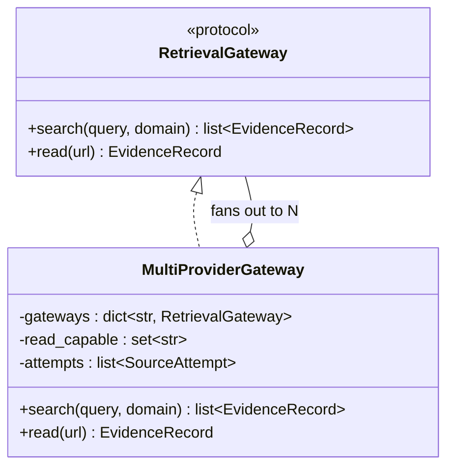
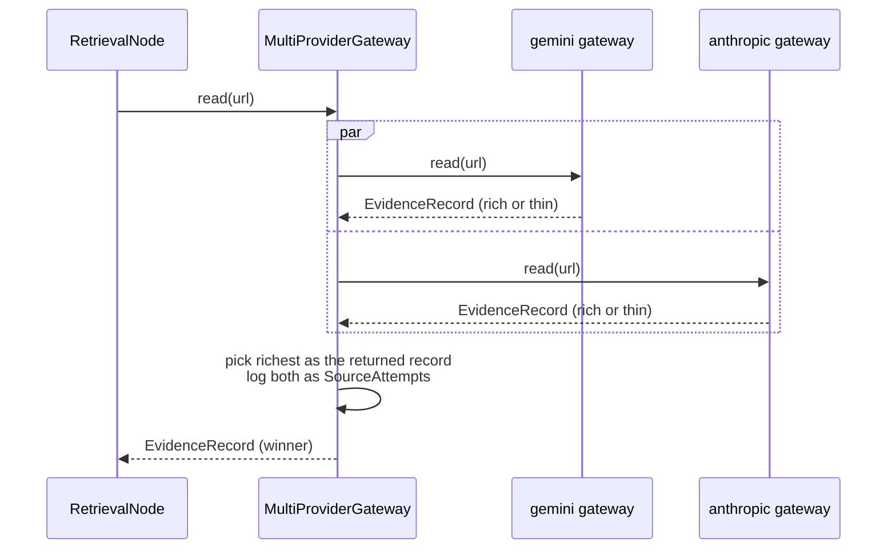
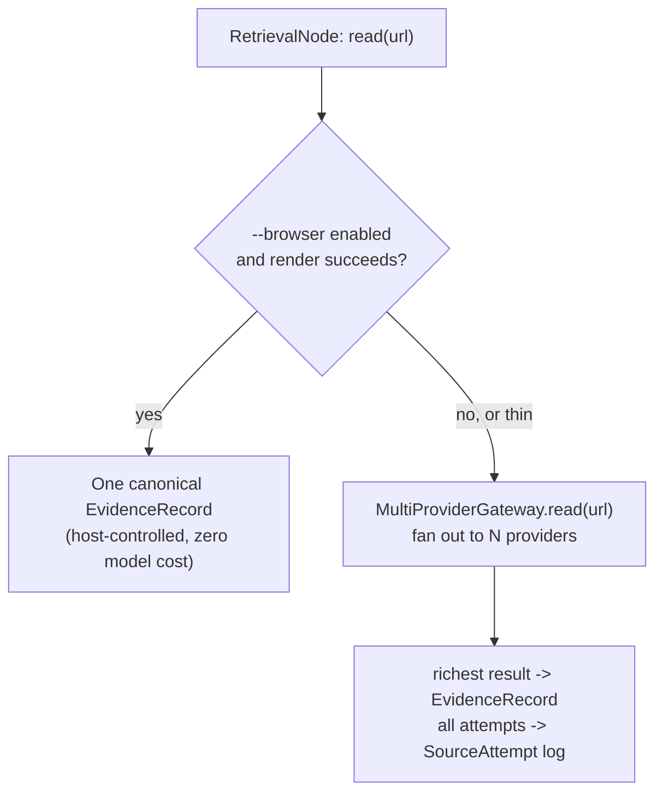

# Multi-provider retrieval: design

This is a design document, not yet implemented. It follows from a live
conversation working through two ideas — running Antigravity and
`pydantic_native` in parallel or as pipeline stages, and adding tiers/an
artifact for unsuccessful sources — and a concrete opening once we checked
actual provider capabilities: Gemini and Anthropic both support native
`WebSearch` *and* `WebFetch`; OpenAI and OpenRouter only support
`WebSearch`. That symmetry is the foundation this design is built on, not
an assumption.

See [`ARCHITECTURE.md`](ARCHITECTURE.md) for the current as-built system
this extends, and [`FINDINGS.md`](FINDINGS.md) for the empirical results
(the `view_file` gap, the `--browser` isolation experiment, the fallback
threshold) this design reuses rather than re-derives.

## 1. What triggered this

- We established (`FINDINGS.md` §3) that under `--browser`, the two
  existing backends' retrieval quality converges — the render happens
  before either backend's own code runs, so the meaningful difference
  becomes latency, not quality.
- We established (this conversation) that `.search()` on both existing
  backends likely hits the *same* underlying search — Antigravity's own
  `search_web` action and Gemini's native search grounding are two
  different plumbing paths to what's probably the same Google index, since
  both currently run on a Gemini model. The backend comparisons this
  session never actually found a meaningful search-quality difference —
  only a read/fetch-quality one.
- Checked the real provider capability matrix (source: `pydantic_ai`
  `native_tools/__init__.py`, `models/{google,anthropic,openai,openrouter}.py`,
  read directly, not assumed):

| Provider | `WebSearch` | `WebFetch` |
|---|---|---|
| Gemini (Google) | yes | yes |
| Anthropic (direct API) | yes | yes — Bedrock/Vertex-hosted clients lose this |
| OpenAI | yes | **no** (`supported_native_tools()` = `{WebSearchTool}` only) |
| OpenRouter | yes (its own "Beta web-search", not necessarily the same index) | **no** |

  Gemini and Anthropic being *fully* symmetric is what makes a genuine
  multi-provider design worth building — it's not "one good provider plus
  degraded fallbacks," it's two independently-capable retrieval paths with
  different underlying search indices and fetch implementations.

## 2. Goals and explicit non-goals

**Goals:**
- Query multiple genuinely independent providers for the same request and
  keep evidence from all of them (not race-and-discard), so the Writer can
  see corroboration or disagreement instead of a single arbitrated answer.
- Make unsuccessful/thin/excluded attempts visible as a structured
  transparency artifact, rather than silently dropped (today's behavior —
  `ValidatorNode` filters `status=="failed"`/`drift_flagged` with nothing
  downstream ever seeing that an attempt happened at all).
- Reuse everything already built and verified: the `RetrievalGateway`
  protocol, `PydanticNativeSearchGateway`, `BrowserAugmentedGateway`, the
  thinness threshold from the response-text fallback. This should compose
  with the existing architecture, not replace it.

**Non-goals (v1):**
- **Automatic semantic corroboration detection.** Comparing two providers'
  independently-formatted extracts of the same page for *agreement* is a
  real NLP problem, not a string comparison. v1 doesn't attempt it — it
  surfaces multiple independent records for the same URL and lets the
  Writer (which is good at reading and cross-checking text) do that
  judgment, the same way it already synthesizes one evidence pool today.
- **Racing/picking a single "best" provider for citation purposes.** The
  point is keeping multiple independent records, not arbitrating one
  winner and throwing the rest away (that would just be a fancier fallback
  chain, not multi-provider corroboration).
- **A general N-provider abstraction for arbitrary future providers beyond
  what's verified above.** Scoped to Gemini + Anthropic (+ optionally
  OpenAI, search-only) because those are the three with a checked capability
  matrix. Adding a fourth provider later means checking its matrix first,
  the same way this document did — not assuming symmetry.

## 3. Architecture: `MultiProviderGateway`



`MultiProviderGateway` is generic over *any* set of already-built
`RetrievalGateway` instances — it doesn't hardcode providers, it composes
them. A typical construction:

```python
MultiProviderGateway({
    "gemini": PydanticNativeSearchGateway("google:gemini-3.7-flash"),
    "anthropic": PydanticNativeSearchGateway("anthropic:claude-..."),
    "openai": PydanticNativeSearchGateway("openai:gpt-...", read_capable=False),
})
```

- **`search(query, domain)`** fans out to *every* configured gateway
  concurrently (`asyncio.gather`), tags each resulting `EvidenceRecord`
  with which provider produced it, and returns the concatenation. This
  needs no protocol change — `search()` already returns `list[EvidenceRecord]`,
  or one logical search naturally producing several.
- **`read(url)`** fans out only to gateways marked `read_capable` (OpenAI
  excluded per §1's matrix, unless configured with a `WebFetch(local=True)`
  fallback — see §6), picks the richest successful result as the returned
  `EvidenceRecord` (reusing the existing `_MIN_USEFUL_READ_CHARS`
  threshold, generalized out of `AntigravitySDKGateway` into a shared
  utility rather than duplicated), and records every attempt — winning or
  not — into `self.attempts` (§5).
- `.search()`/`.read()` both still return the same types the protocol
  already promises; nothing about the existing single-provider gateways or
  `BrowserAugmentedGateway` needs to change to keep working.

### 3.1 One `read()` call, fanned out



## 4. Evidence model changes

- **`EvidenceRecord` gains `provider: str | None`** (`"gemini"`,
  `"anthropic"`, `"openai"`, `"antigravity"`, `"browser"`, or `None` for
  backends where the concept doesn't apply). Additive, optional field — no
  existing gateway or test needs to change.
- **`ValidatorNode`'s dedup key changes from `source_url` alone to
  `(source_url, provider)`.** Today, deduplicating by URL alone is correct
  — one gateway, one attempt, one record. With multi-provider fan-out, two
  *different* providers reading the *same* URL independently is the whole
  point (corroboration), not a duplicate to collapse. Same-provider,
  same-URL repeats still dedupe as before.

## 5. Tiers and `SourceAttempt`: the transparency artifact

```python
class SourceAttempt(BaseModel):
    request_id: str          # matches SearchOrFetchRequest.request_id
    provider: str
    action: Literal["search", "read"]
    query_or_url: str
    tier: Literal["verified", "thin", "triage_only", "excluded"]
    evidence_id: str | None  # set if this attempt made it into evidence_pool
    status: Literal["success", "failed"]
    char_count: int          # len(raw_extract) at the time of the attempt
    note: str                 # e.g. "below 80-char threshold", "drift: requested X, got Y"
    timestamp: datetime
```

| Tier | Meaning |
|---|---|
| `verified` | `page_content`, above the thinness threshold, made it into the evidence pool |
| `thin` | `page_content`, but below threshold (or only reached via a fallback like the response-text one) — still technically citable, worth flagging as lower-confidence |
| `triage_only` | `search_summary` — informed the Writer's context, never citable |
| `excluded` | failed or drift-flagged — attempted, unusable, currently invisible everywhere except log files |

This isn't exclusive to multi-provider — a single-provider run has exactly
one attempt per request and one tier per attempt, so the schema degrades
cleanly. But multi-provider fan-out is what makes it *valuable*: a
single-provider `read()` failing has no interesting attempt-level story to
tell (there was one attempt, it's already the `EvidenceRecord` or the
`_missing_call_record`); a 2-3-provider fan-out has a real story (which
providers got real content, which didn't, was there a drift flag on one
but not the other).

**Where it lives:** `MultiProviderGateway` accumulates `self.attempts`
internally as it fans out. `RetrievalNode` reads it duck-typed
(`getattr(gateway, "attempts", [])`) into a new `PipelineState.source_attempts`
field — existing single-provider gateways need zero changes; they simply
don't have an `attempts` attribute, and the pipeline treats that as "no
attempt log available," not an error.

**Output shape — a real decision point, not yet resolved:** exposing this
means `run_research()`'s return type needs to grow. Two options:
1. **Breaking change**: return a new `ResearchReport(answer: ResearchAnswer,
   source_attempts: list[SourceAttempt])` instead of bare `ResearchAnswer`.
   More useful, but changes the public API and the CLI's JSON output shape.
2. **Non-breaking**: keep `run_research()` returning `ResearchAnswer`
   unchanged, and only expose `source_attempts` via `PipelineState` for
   callers who run the graph directly, or via a side-channel like a log
   line. Preserves compatibility, but the transparency artifact stays
   half-buried — exactly the problem this section exists to fix.

Recommendation: option 1. This project has iterated on `run_research()`'s
signature repeatedly already (`use_headless_browser`, `enable_otel_tracing`)
without stability guarantees; a `ResearchReport` wrapper is a small,
one-time break for a feature that's the whole point of this section.
Needs confirmation before implementing, not assumed.

## 6. How this composes with what already exists

- **Per-provider escalation is unchanged.** `AntigravitySDKGateway`'s
  `read_url_content → view_file → response-text fallback` chain
  (`FINDINGS.md` §3.1) still applies inside that provider's own attempt,
  same as today. Multi-provider fan-out sits *above* this, not instead of
  it — each provider still does its best single attempt; fan-out is what
  happens across providers, not within one.
- **Browser augmentation's role gets sharper, and this resolves the
  earlier "why start with browser" question properly.** The original
  answer ("richest content") was the wrong justification. The right one:
  a headless-Chromium render is a single, deterministic, host-controlled
  fetch — not LLM-mediated, so there's no such thing as "the Gemini render"
  vs. "the Anthropic render" of the same page; it's one canonical result,
  and it costs zero model tokens. Multi-provider fan-out, by contrast, is
  N model-mediated calls, each with real API cost. So the well-justified
  ordering is: **try the browser render once (cheap, canonical, host-side)
  before spending N provider calls on N potentially-divergent LLM-mediated
  fetches of the same URL** — not because browser content is inherently
  better, but because it's the cheaper way to get a single trustworthy
  answer when it works, reserving the more expensive multi-provider
  fan-out for when it doesn't (render failure, or content still thin/
  ambiguous after rendering).
- **OpenAI's asymmetry (§1) means it participates differently.** Configured
  `read_capable=False` by default — it contributes an independent search
  perspective (a third, genuinely different index) without pretending to
  do fetches it structurally can't. `WebFetch(local=True)` (the bundled
  `httpx` + `markdownify` tool, verified non-JS-capable — see the earlier
  conversation) is available as an opt-in if OpenAI-sourced reads are
  wanted anyway, at the same fidelity ceiling as any other static fetch.



## 7. Cost and latency, stated plainly

This is not free, and shouldn't be framed as free. A 2-provider fan-out
roughly doubles model-call cost and latency for every `read()`/`search()`
that reaches it; 3 providers roughly triples it. `ResearchPlan` already
caps at 5 requests — a fully-fanned-out plan could mean up to 15 real
fetch/search calls instead of 5. This should be **opt-in**, the same way
`--browser` and `enable_otel_tracing` are — a `use_multi_provider=` flag
threaded through `default_deps()`/`run_research()`/the CLI, not a new
default. §6's browser-first ordering is exactly the mechanism that keeps
the common case cheap: most `read()` calls should resolve via the browser
stage and never reach the expensive fan-out at all.

## 8. Open questions / phased build order

Following this project's established pattern (build a thin slice, verify
live, expand — not the whole design in one shot):

1. **`EvidenceRecord.provider` + the `(url, provider)` dedup key change**
   (§4) — small, additive, unblocks everything else, easy to verify with
   existing tests plus one new dedup test.
2. **`MultiProviderGateway.search()` only** — no `read()` fan-out yet, just
   concurrent multi-provider search tagged by provider. Lowest risk (search
   results were never deduplicated for richness anyway), and lets us
   actually check the "do Gemini and Anthropic's search results meaningfully
   differ" question empirically, which this document has assumed but not
   yet verified live.
3. **`SourceAttempt` + `PipelineState.source_attempts`**, populated from
   whatever `MultiProviderGateway.search()` produced in step 2 — verify the
   tiering logic on real data before extending it to `read()`.
4. **`MultiProviderGateway.read()` fan-out**, reusing the generalized
   thinness-threshold utility from `AntigravitySDKGateway`.
5. **`ResearchReport` output shape** (§5) — once there's something real to
   put in `source_attempts`, decide the breaking-vs-non-breaking question
   for real rather than in the abstract.
6. Re-run this session's live comparisons (LangChain/Agno, Firefox/Chrome,
   nginx/Apache) with multi-provider enabled and record whether
   corroboration/tiering actually changed anything, in `FINDINGS.md` —
   same live-verification discipline as every other change in this
   project, not assumed to work because the design is sound on paper.
