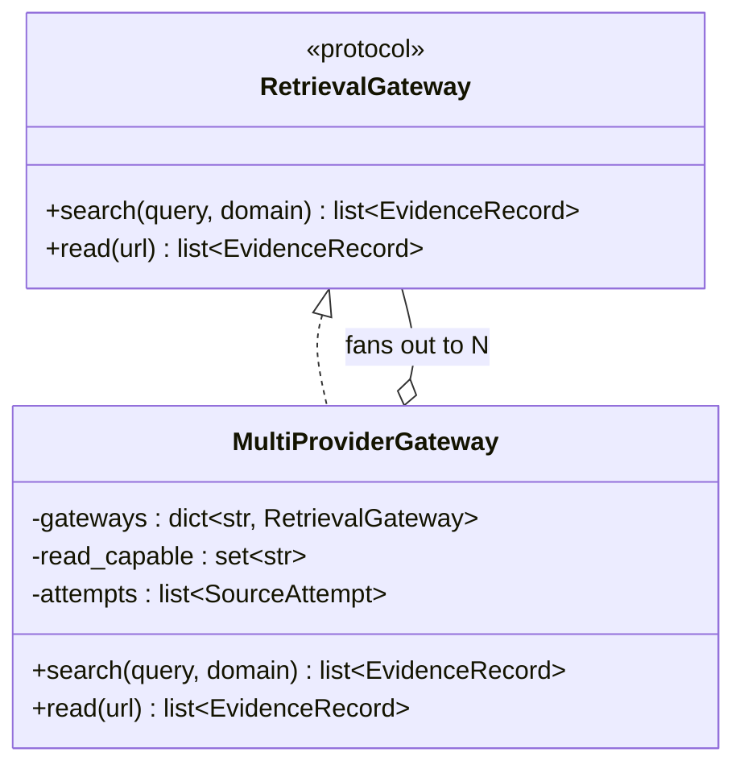
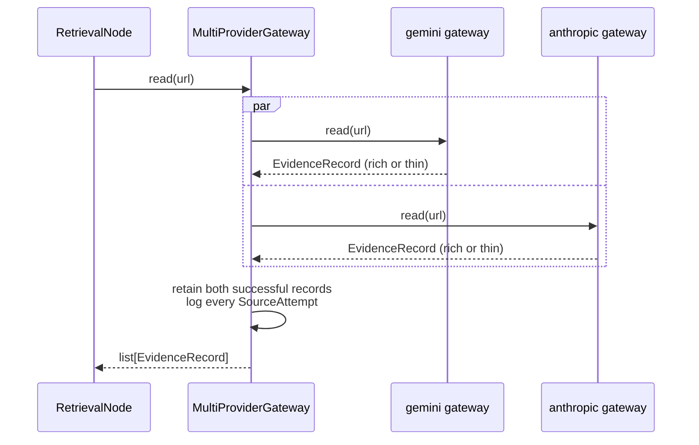
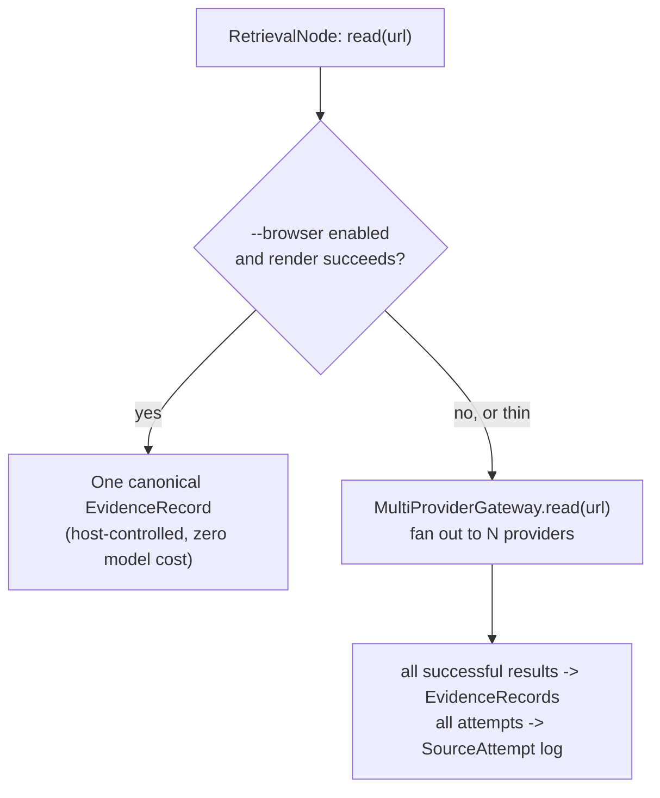

# Multi-provider retrieval: design

This is a design document, not yet implemented. It follows from a live
conversation working through two ideas — running Antigravity and
`pydantic_native` in parallel or as pipeline stages, and adding tiers/an
artifact for unsuccessful sources — and a concrete opening once we checked
actual provider capabilities: Gemini and Anthropic both support native
`WebSearch` *and* `WebFetch`; OpenAI and OpenRouter only support
`WebSearch`. That symmetry is the foundation this design is built on, not
an assumption. The design has since been revised against the nine research
pipeline traces currently available in Logfire (2026-08-20) and an exhaustive
review of the repository's logging call sites. Those traces validate some of
the motivation below, but they do **not** yet test Gemini against Anthropic;
that remains an experiment this design must run before treating provider
independence as established.

See [`ARCHITECTURE.md`](ARCHITECTURE.md) for the current as-built system
this extends, and [`FINDINGS.md`](FINDINGS.md) for the empirical results
(the `view_file` gap, the `--browser` isolation experiment, the fallback
threshold) this design reuses rather than re-derives.

## 1. What triggered this

- We established (`FINDINGS.md` §3) that under `--browser`, the two
  existing backends' retrieval quality converges — the render happens
  before either backend's own code runs, so the meaningful difference
  becomes latency, not quality.
- We established (this conversation) that `.search()` on both existing
  backends likely hits the *same* underlying search — Antigravity's own
  `search_web` action and Gemini's native search grounding are two
  different plumbing paths to what's probably the same Google index, since
  both currently run on a Gemini model. The backend comparisons this
  session never actually found a meaningful search-quality difference —
  only a read/fetch-quality one.
- Checked the real provider capability matrix (source: `pydantic_ai`
  `native_tools/__init__.py`, `models/{google,anthropic,openai,openrouter}.py`,
  read directly, not assumed):

| Provider | `WebSearch` | `WebFetch` |
|---|---|---|
| Gemini (Google) | yes | yes |
| Anthropic (direct API) | yes | yes — Bedrock/Vertex-hosted clients lose this |
| OpenAI | yes | **no** (`supported_native_tools()` = `{WebSearchTool}` only) |
| OpenRouter | yes (its own "Beta web-search", not necessarily the same index) | **no** |

  Gemini and Anthropic being capability-symmetric is what makes a genuine
  multi-provider design worth testing — it is not structurally "one good
  provider plus degraded fallbacks." Whether their retrieval paths are
  independent enough in practice, and whether that difference improves the
  Writer's evidence, is the empirical question in §8 rather than a fact
  inferred from the capability matrix.

### 1.1 What the Logfire review actually establishes

The current telemetry contains nine complete `research_pipeline` traces:
two Python-release smoke runs and paired or repeated LangChain/Agno,
Firefox/Chrome, and nginx/Apache comparisons. Its conclusions are narrower
than the provider capability matrix:

- **Browser-first is validated.** In the comparison runs, the Writer received
  two or three `page_content` records while the traces contained no
  `native_fetch_agent` spans and, except for one earlier Python smoke run, no
  Antigravity `read_url_content` spans. Successful Chromium renders bypassed
  both model-mediated read paths exactly as intended. The same rendered page
  content reached the Writer regardless of which search backend was selected.
- **Retrieval dominates wall time.** Across the nine runs, the graph averaged
  52.0 seconds: Retrieval averaged 40.3 seconds, versus 5.0 seconds for the
  Planner and 6.6 seconds for the Writer. Optimizing retrieval concurrency and
  avoiding unnecessary provider calls therefore matters materially.
- **The existing backend comparison is not a provider-independence test.** All
  visible `pydantic_native` retrieval calls used `gemini-3.7-flash`; the
  existing Antigravity path also uses Gemini/Google retrieval. Their search
  summaries overlap substantially, which is consistent with the same-index
  hypothesis, but the generated search queries varied between runs. There are
  no Anthropic or OpenAI retrieval traces.
- **Current cost telemetry is not comparable across backends.** Pydantic AI
  token and cost metrics include `pydantic_native` search agents. Antigravity's
  OTel spans expose its lifecycle and timing but do not contribute equivalent
  model token/cost totals to the root graph span. Apparent native-versus-
  Antigravity cost differences are therefore instrumentation differences, not
  reliable provider-cost measurements.
- **The final Writer input is observable, but evidence provenance is not.** A
  Writer span shows the post-validation evidence pool. It does not say which
  raw records were rejected, why they were rejected, which extraction path
  produced a surviving record, or whether a successful browser render avoided
  a provider call.

The next live comparison must therefore use a fixed `ResearchPlan` (or at
minimum a stable experiment id and plan hash) and run the same exact queries
through Gemini and Anthropic. Re-running the Planner for each backend is not a
controlled provider comparison because planner nondeterminism changes the
workload before retrieval begins.

## 2. Goals and explicit non-goals

**Goals:**
- Query multiple genuinely independent providers for the same request and
  keep evidence from all of them (not race-and-discard), so the Writer can
  see corroboration or disagreement instead of a single arbitrated answer.
- Make unsuccessful/thin/excluded attempts visible as a structured
  transparency artifact, rather than silently dropped (today's behavior —
  `ValidatorNode` filters `status=="failed"`/`drift_flagged` with nothing
  downstream ever seeing that an attempt happened at all).
- Reuse everything already built and verified: the `RetrievalGateway`
  protocol, `PydanticNativeSearchGateway`, `BrowserAugmentedGateway`, the
  thinness threshold from the response-text fallback. This should compose
  with the existing architecture, not replace it.

**Non-goals (v1):**
- **Automatic semantic corroboration detection.** Comparing two providers'
  independently-formatted extracts of the same page for *agreement* is a
  real NLP problem, not a string comparison. v1 doesn't attempt it — it
  surfaces multiple independent records for the same URL and lets the
  Writer (which is good at reading and cross-checking text) do that
  judgment, the same way it already synthesizes one evidence pool today.
- **Racing/picking a single "best" provider for citation purposes.** The
  point is keeping multiple independent records, not arbitrating one
  winner and throwing the rest away (that would just be a fancier fallback
  chain, not multi-provider corroboration).
- **A general N-provider abstraction for arbitrary future providers beyond
  what's verified above.** Scoped to Gemini + Anthropic (+ optionally
  OpenAI, search-only) because those are the three with a checked capability
  matrix. Adding a fourth provider later means checking its matrix first,
  the same way this document did — not assuming symmetry.

## 3. Architecture: `MultiProviderGateway`



`MultiProviderGateway` is generic over *any* set of already-built
`RetrievalGateway` instances — it doesn't hardcode providers, it composes
them. A typical construction:

```python
MultiProviderGateway({
    "gemini": PydanticNativeSearchGateway("google:gemini-3.7-flash"),
    "anthropic": PydanticNativeSearchGateway("anthropic:claude-..."),
    "openai": PydanticNativeSearchGateway("openai:gpt-...", read_capable=False),
})
```

- **`search(query, domain)`** fans out to *every* configured gateway
  concurrently (`asyncio.gather`), tags each resulting `EvidenceRecord`
  with which provider produced it, and returns the concatenation. This
  needs no protocol change — `search()` already returns `list[EvidenceRecord]`,
  or one logical search naturally producing several.
- **`read(url)`** fans out only to gateways marked `read_capable` (OpenAI
  excluded per §1's matrix, unless configured with a `WebFetch(local=True)`
  fallback — see §6), and returns **every successful provider record**, tagged
  by provider. It records successful, thin, failed, and excluded attempts in
  `self.attempts` (§5). It may compute a `richest` marker for presentation or
  ordering, but must not discard the other providers' text.
- This requires one deliberate protocol generalization: `read()` changes from
  `EvidenceRecord` to `list[EvidenceRecord]`. Existing single-provider
  gateways and a successful `BrowserAugmentedGateway` return singleton lists;
  `run_plan()` extends its result for both actions instead of appending reads.
  Without this change, the Writer cannot perform the corroboration promised in
  §2: `SourceAttempt` carries metadata, not the losing provider's extract.

### 3.1 One `read()` call, fanned out



## 4. Evidence model changes

- **`EvidenceRecord` gains `provider: str | None`** (`"gemini"`,
  `"anthropic"`, `"openai"`, `"antigravity"`, `"browser"`, or `None` for
  backends where the concept doesn't apply). Additive, optional field — no
  existing gateway or test needs to change.
- **`ValidatorNode`'s dedup key changes from `source_url` alone to
  `(source_url, provider)`.** Today, deduplicating by URL alone is correct
  — one gateway, one attempt, one record. With multi-provider fan-out, two
  *different* providers reading the *same* URL independently is the whole
  point (corroboration), not a duplicate to collapse. Same-provider,
  same-URL repeats still dedupe as before.

## 5. Tiers and `SourceAttempt`: the transparency artifact

```python
class SourceAttempt(BaseModel):
    request_id: str          # matches SearchOrFetchRequest.request_id
    provider: str
    action: Literal["search", "read"]
    query_or_url: str
    tier: Literal["verified", "thin", "triage_only", "excluded"]
    evidence_id: str | None  # set if this attempt made it into evidence_pool
    status: Literal["success", "failed"]
    char_count: int          # len(raw_extract) at the time of the attempt
    duration_ms: float
    extraction_method: Literal[
        "browser", "native_tool", "antigravity_tool", "local_fetch",
        "response_text_fallback", "unknown"
    ]
    note: str                 # e.g. "below 80-char threshold", "drift: requested X, got Y"
    timestamp: datetime
```

| Tier | Meaning |
|---|---|
| `verified` | Structurally citable `page_content`, above the thinness threshold, made it into the evidence pool; this does not assert semantic completeness or factual correctness |
| `thin` | `page_content` still below the threshold after all available fallbacks — technically citable under the current grounding contract, but explicitly lower-confidence |
| `triage_only` | `search_summary` — informed the Writer's context, never citable |
| `excluded` | failed or drift-flagged — attempted, unusable, currently invisible everywhere except log files |

`extraction_method` is separate from `tier`: a rich response-text fallback is
not automatically thin merely because of how it was obtained. Likewise,
`char_count` is a diagnostic rather than proof of semantic sufficiency. The
Python-release traces produced successful page content but still lacked the
specific version needed to answer the question; the Writer correctly surfaced
that limitation despite the record passing structural validation.

This is not exclusive to multi-provider. A single-provider run has exactly one
attempt per request and one tier per attempt, and the telemetry review shows
that its fallback and exclusion story is still operationally important.
Multi-provider fan-out makes the artifact richer rather than making it useful
for the first time.

**Where it lives:** every gateway accumulates `self.attempts`; the
`MultiProviderGateway` combines the child attempts as it fans out.
`RetrievalNode` copies them into a new `PipelineState.source_attempts` field.
Making this part of the gateway contract avoids a silent split where only new
multi-provider runs are diagnosable and existing single-provider runs retain
today's gaps.

### 5.1 Current observability gaps and required trace shape

Excluding tracing initialization and third-party SDK chatter, an exhaustive
call-site review found exactly six retrieval/pipeline diagnostic events emitted
by the application to Python logging rather than structured attempt spans:

1. Antigravity turn failure (SDK exception).
2. The Antigravity response-text fallback firing.
3. `pydantic_native` turn failure.
4. Writer grounding-validation retry/failure.
5. Browser render failure.
6. Browser render producing empty text.

These are plain log messages rather than a consistent structured attempt
schema. Four important paths are completely silent:

- `ValidatorNode` filtering and deduplication: no counts or reasons for
  failed, drift-flagged, or duplicate records being removed.
- Drift detection at the moment `drift_flagged=True` is set, despite a drift
  false-positive having caused a live bug (`FINDINGS.md` §1.2).
- Successful browser renders: no success event, duration, content length, or
  explicit indication that the provider read was bypassed.
- `PipelineState`: raw evidence, the evidence pool, attempts, and tier data are
  unavailable through the normal `run_research()` API, which returns only the
  final `ResearchAnswer`.

Before multi-provider behavior is added, emit one parent retrieval span per
logical request and one child attempt span per browser/provider attempt. Use
stable, queryable attributes rather than requiring prompt inspection:

- run/experiment: `experiment_id`, `scenario`, `plan_hash`, configured
  backend(s), model(s), and `browser_enabled`;
- request: `request_id`, `action`, normalized query or URL, and fan-out size;
- attempt: `provider`, `model`, `status`, `duration_ms`, `char_count`,
  `source_kind`, `tier`, `extraction_method`, `drift_flagged`, and error;
- validation: raw count, kept count, and counts dropped by failed, drift, and
  duplicate reason, plus the assigned `evidence_id` where applicable;
- cost: normalized input/output tokens and provider cost when the provider
  exposes them, explicitly null/unknown otherwise.

Do not enable full HTTP payload capture by default. The existing structured
Pydantic AI spans already make prompts and model content available for targeted
debugging; attempt metadata supplies the missing operational facts without
expanding secret-bearing payload capture.

**Output shape — resolved recommendation:** exposing this means
`run_research()`'s return type needs to grow. The two available shapes are:
1. **Breaking change**: return a new `ResearchReport(answer: ResearchAnswer,
   source_attempts: list[SourceAttempt])` instead of bare `ResearchAnswer`.
   More useful, but changes the public API and the CLI's JSON output shape.
2. **Non-breaking**: keep `run_research()` returning `ResearchAnswer`
   unchanged, and only expose `source_attempts` via `PipelineState` for
   callers who run the graph directly, or via a side-channel like a log
   line. Preserves compatibility, but the transparency artifact stays
   half-buried — exactly the problem this section exists to fix.

Recommendation: option 1. The telemetry review makes this more than a product-
shape preference: `PipelineState` is otherwise inaccessible through the normal
API, and all prior evidence debugging required ad-hoc scripts against graph
internals. This project has iterated on `run_research()`'s
signature repeatedly already (`use_headless_browser`, `enable_otel_tracing`)
without stability guarantees; a `ResearchReport` wrapper is a small,
one-time break for a feature that's the whole point of this section.

## 6. How this composes with what already exists

- **Per-provider escalation is unchanged.** `AntigravitySDKGateway`'s
  `read_url_content → view_file → response-text fallback` chain
  (`FINDINGS.md` §3.1) still applies inside that provider's own attempt,
  same as today. Multi-provider fan-out sits *above* this, not instead of
  it — each provider still does its best single attempt; fan-out is what
  happens across providers, not within one.
- **Browser augmentation's role gets sharper, and this resolves the
  earlier "why start with browser" question properly.** The original
  answer ("richest content") was the wrong justification. The right one:
  a headless-Chromium render is a single, deterministic, host-controlled
  fetch — not LLM-mediated, so there's no such thing as "the Gemini render"
  vs. "the Anthropic render" of the same page; it's one canonical result,
  and it costs zero model tokens. Multi-provider fan-out, by contrast, is
  N model-mediated calls, each with real API cost. So the well-justified
  ordering is: **try the browser render once (cheap, canonical, host-side)
  before spending N provider calls on N potentially-divergent LLM-mediated
  fetches of the same URL** — not because browser content is inherently
  better, but because it's the cheaper way to get a single trustworthy
  answer when it works, reserving the more expensive multi-provider
  fan-out for when it doesn't (render failure, or content still thin/
  ambiguous after rendering).
- **OpenAI's asymmetry (§1) means it participates differently.** Configured
  `read_capable=False` by default — it contributes an independent search
  perspective (a third, genuinely different index) without pretending to
  do fetches it structurally can't. `WebFetch(local=True)` (the bundled
  `httpx` + `markdownify` tool, verified non-JS-capable — see the earlier
  conversation) is available as an opt-in if OpenAI-sourced reads are
  wanted anyway, at the same fidelity ceiling as any other static fetch.



## 7. Cost and latency, stated plainly

This is not free, and shouldn't be framed as free. A 2-provider fan-out
roughly doubles model-call count and expected model cost for every
`read()`/`search()` that reaches it; 3 providers roughly triples them.
Because provider calls for one logical request run concurrently, wall latency
should approach the slowest provider attempt rather than the sum. It can still
increase through rate limits, contention, connection setup, retries, or a slow
tail, so it must be measured rather than promised either way. `ResearchPlan`
already caps at 5 requests — a fully-fanned-out plan could mean up to 15 real
fetch/search calls instead of 5, while `run_plan()` still executes the five
logical requests sequentially. This should be **opt-in**, the same way
`--browser` and `enable_otel_tracing` are — a `use_multi_provider=` flag
threaded through `default_deps()`/`run_research()`/the CLI, not a new
default. §6's browser-first ordering is exactly the mechanism that keeps
the common case cheap: most `read()` calls should resolve via the browser
stage and never reach the expensive fan-out at all.

## 8. Open questions / phased build order

Following this project's established pattern (build a thin slice, verify
live, expand — not the whole design in one shot):

1. **Instrument the current single-provider pipeline first** (§5.1): gateway
   attempt spans, browser-success spans, drift events, Validator decision
   counts/reasons, experiment metadata, and normalized cost fields. This gives
   the next phases a trustworthy baseline.
2. **Add `SourceAttempt`, `PipelineState.source_attempts`, and
   `ResearchReport`** (§5) for existing gateways, including extraction method
   and duration. Verify the tiering logic on current live cases before fan-out.
3. **Generalize the evidence contract**: add `EvidenceRecord.provider`, change
   `read()` to return a list, make `run_plan()` extend both actions, and change
   deduplication to `(url, provider)` (§3–4). Add regression tests proving that
   two provider reads of the same URL both reach the Writer.
4. **Run a controlled search experiment before building orchestration**:
   execute one fixed `ResearchPlan` through Gemini and Anthropic, with exact
   identical queries and an `experiment_id`/`plan_hash`. Record result overlap,
   unique useful facts, latency, failures, tokens, and cost. This is the first
   empirical test of the design's central independence premise.
5. **Build `MultiProviderGateway.search()`** only after step 4 establishes that
   the second provider contributes enough independent value to justify its
   cost. Fan out concurrently, tag every result, and retain all results.
6. **Build `MultiProviderGateway.read()` fan-out**, retaining every successful
   provider extract and reusing the generalized thinness-threshold utility
   from `AntigravitySDKGateway`. Browser success still short-circuits this to
   one canonical singleton result.
7. Re-run this session's live comparisons (LangChain/Agno, Firefox/Chrome,
   nginx/Apache) with multi-provider enabled and record whether
   corroboration/tiering actually changed anything, in `FINDINGS.md` —
   same live-verification discipline as every other change in this
   project, not assumed to work because the design is sound on paper.
