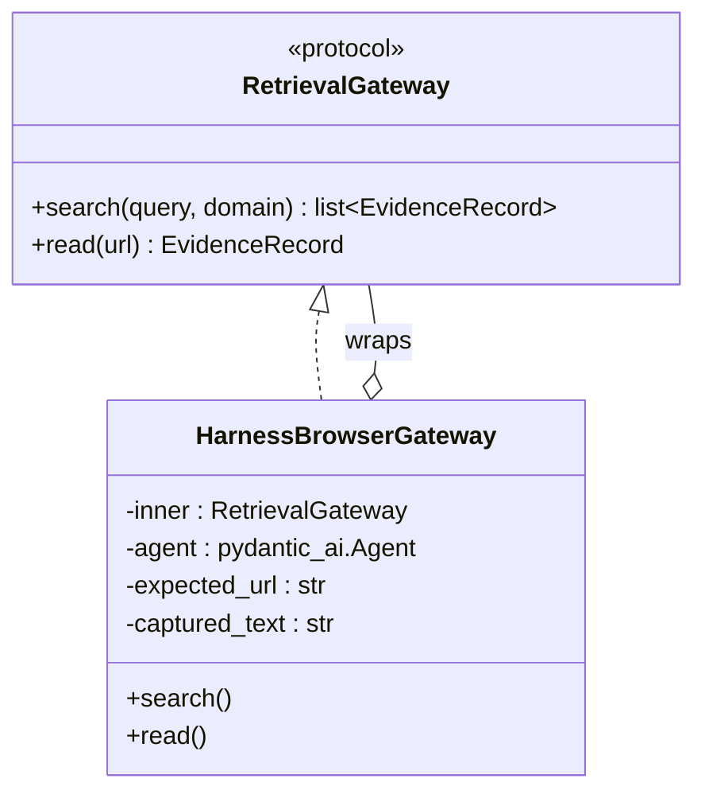

# Replacing hand-rolled Playwright with `pydantic-ai-harness[playwright]`

Design document, not yet implemented. Follows from checking
`https://pydantic.dev/docs/ai/harness/playwright/` against the actual
installed source (`pydantic-ai-harness==0.24.0`, temporarily installed via
`uv run --with` to read the real code, not just the docs page) rather than
taking the docs at face value — same discipline as every other finding in
this project.

See [`browser_gateway.py`](src/pydagy_research/browser_gateway.py) for the
current hand-rolled implementation this replaces, and
[`ARCHITECTURE.md`](ARCHITECTURE.md) §5 for how it fits into the retrieval
gateway composition today.

## 1. What's verified

| Question | Answer | Source |
|---|---|---|
| Does the harness expose pre/post tool-call hooks? | Yes — `ToolGuardrail(guard=, result_guard=)`. `guard` sees `ToolCallInfo` (`.name`, `.args`) before the tool runs; `result_guard` sees `ToolResultInfo` (`.result`) — the tool's **raw** return, before the model paraphrases it or anything truncates it. | `guardrails/README.md`, `guardrails/_tool_guardrail.py` |
| Does `navigate` return real content directly? | Yes — `navigate(url) -> str \| ToolReturn[str]`, docstring: *"Navigate to a URL and return the page's title and visible text."* No separate `get_text` call needed for the base case. | `playwright/_toolset.py:1911` |
| Built-in safety beyond what we hand-rolled? | Yes — `allowed_domains` (two-layer egress allowlist: network route guard + per-tool URL re-check) and **`block_private_addresses=True` by default** (refuses the cloud metadata endpoint, loopback, RFC1918 — real SSRF protection `BrowserAugmentedGateway` has none of today). | `playwright/_capability.py` |
| Built-in tracing? | Yes — *"Every browser operation runs inside an OpenTelemetry span"*, adopting the run's own tracer. Closes the "successful browser render logs nothing" gap flagged in the instrumentation review. | `playwright/_capability.py` docstring |
| Does the browser session persist across multiple `agent.run()` calls? | **No.** `for_run()` returns `replace(self)` — *"a fresh instance per run so concurrent runs never share a page or browser."* `wrap_run()` opens `async with self._session:` around one run and closes it when that run ends. A new Chromium launches per `.run()` call unless attached to an externally-managed browser via `cdp_url`. | `playwright/_capability.py:302-327` |
| Can the 18 tools be restricted to just `navigate`? | Not via a built-in allowlist parameter (unlike Antigravity's `enabled_tools`, which strips a tool's schema from the model's context entirely). `hidden`/`defer_loading` is a *different* mechanism (progressive disclosure — a tool starts hidden until something surfaces it), not a permanent restriction. The available lever is `ToolGuardrail.guard` blocking any call whose `name != 'navigate'` — functionally locks it down, but the other 17 tool schemas still cost context tokens, unlike a true allowlist. | `pydantic_ai/tools.py:618`, `capabilities/abstract.py:217` |
| New dependency footprint? | `pydantic-ai-harness[playwright]==0.24.0` pulls in `playwright==1.62.0` — the exact version already in this project's `browser` extra. A clean swap, not an addition; `playwright install chromium` stays the same setup step. | confirmed live via `uv run --with` |

## 2. Design: `HarnessBrowserGateway`

Same external contract as `BrowserAugmentedGateway` today — same
constructor shape, same `RetrievalGateway` protocol, same
wraps-an-inner-gateway pattern — so `graph.default_deps()` and everything
above it needs **zero changes**. Only the internals swap from raw
`playwright.async_api` to the harness's `PlaywrightBrowser` capability.



```python
class HarnessBrowserGateway:
    """Drop-in replacement for BrowserAugmentedGateway's Playwright internals,
    using pydantic-ai-harness's PlaywrightBrowser + ToolGuardrail instead of
    raw playwright.async_api -- same RetrievalGateway contract, same
    wrap-an-inner-gateway pattern.
    """

    def __init__(
        self,
        inner: RetrievalGateway,
        *,
        model: Any,
        allowed_domains: list[str] | None = None,
        block_private_addresses: bool = True,  # matches the harness default
    ) -> None:
        self._inner = inner
        self._model = model
        self._allowed_domains = allowed_domains
        self._block_private_addresses = block_private_addresses
        self._expected_url: str | None = None
        self._captured_text: str | None = None
        self._captured_title: str | None = None

    async def __aenter__(self) -> "HarnessBrowserGateway":
        await self._inner.__aenter__()
        return self

    async def __aexit__(self, *exc_info: object) -> None:
        await self._inner.__aexit__(*exc_info)

    async def search(self, query: str, domain: str | None = None) -> list[EvidenceRecord]:
        return await self._inner.search(query, domain)  # unchanged, same as BrowserAugmentedGateway

    async def read(self, url: str) -> EvidenceRecord:
        from pydantic_ai import Agent
        from pydantic_ai_harness import GuardrailResult, ToolGuardrail
        from pydantic_ai_harness.guardrails import ToolCallInfo, ToolResultInfo
        from pydantic_ai_harness.playwright import PlaywrightBrowser

        self._expected_url = url
        self._captured_text = None
        self._captured_title = None

        def _drift_check(call: ToolCallInfo) -> GuardrailResult:
            # Structural equivalent of AntigravitySDKGateway._pre_tool_call's
            # drift check (gateway.py) -- verify the tool actually executed
            # against the requested URL, not a URL the model wandered to.
            if call.name != "navigate":
                return GuardrailResult.block(
                    "This gateway only permits navigate() -- read-only, single-page fetch."
                )
            if _normalize(str(call.args.get("url", ""))) != _normalize(url):
                return GuardrailResult.block(
                    f"drift: expected {url!r}, got {call.args.get('url')!r}"
                )
            return GuardrailResult.allow()

        def _capture_result(info: ToolResultInfo) -> GuardrailResult:
            # Structural equivalent of _post_tool_call's typed extraction --
            # stash the RAW navigate() result before the model paraphrases it.
            if isinstance(info.result, str):
                self._captured_text = info.result
            return GuardrailResult.allow()  # never blocks; this is capture-only

        agent = Agent(
            self._model,
            name="harness_browser_read_agent",
            capabilities=[
                PlaywrightBrowser(
                    allowed_domains=self._allowed_domains,
                    block_private_addresses=self._block_private_addresses,
                ),
                ToolGuardrail(guard=_drift_check, result_guard=_capture_result),
            ],
        )

        try:
            await agent.run(f"Use navigate to open exactly this URL: {url!r}. Report what you found.")
        except Exception as exc:  # AgentRunError, UserError (e.g. domain refused), etc.
            _logger.warning("Harness browser read failed for %s (%s); falling back to inner gateway", url, exc)
            return await self._inner.read(url)

        if not self._captured_text or not self._captured_text.strip():
            _logger.info("Harness browser read of %s produced no text; falling back to inner gateway", url)
            return await self._inner.read(url)

        return EvidenceRecord(
            evidence_id=_temp_evidence_id(),
            source_url=url,
            source_kind="page_content",
            title=self._captured_title or url,
            raw_extract=self._captured_text,
            timestamp=_now(),
            status="success",
        )
```

This is a sketch, not final code — the exact `navigate` result shape
(`str` vs `ToolReturn[str]` when `screenshot_on_navigate` is involved,
title extraction specifically) needs confirming against a live call before
this is implemented for real, the same way every other piece of this
project got verified against live behavior rather than assumed from a
docstring.

## 3. What this trades away, stated plainly

- **A fresh Chromium launches per `read()` call, not once per gateway
  session.** `BrowserAugmentedGateway` today launches one browser in
  `__aenter__` and reuses it across every read in a plan; the harness's
  `for_run()`/`wrap_run()` design scopes the session to one `agent.run()`
  call by design ("concurrent runs never share a page or browser"). For a
  5-request plan with 2-3 reads, that's 2-3 separate launches instead of 1.
  Two ways to close this gap, neither implemented yet:
  1. **Accept it initially.** Headless Chromium launch is on the order of
     1-2 seconds; `ResearchPlan` is capped at 5 requests, so the worst case
     is bounded, not unbounded. Consistent with this project's pattern of
     shipping the simple version and only optimizing once live data shows
     it matters.
  2. **`cdp_url`.** The capability explicitly supports attaching to an
     already-running Chromium rather than launching one. We could launch
     one persistent browser ourselves (ironically, via raw
     `playwright.async_api` — the exact code this document proposes
     removing) once per gateway session, and hand every per-read
     `PlaywrightBrowser(cdp_url=...)` instance that same endpoint. Keeps
     the guardrail/safety benefits, gives back the session-reuse
     efficiency, at the cost of still owning some raw Playwright
     lifecycle code — a partial, not full, replacement of the hand-rolled
     path.
- **Tool restriction is a runtime block, not a context-level allowlist.**
  `ToolGuardrail.guard` blocking non-`navigate` calls stops the *action*,
  but the model still sees all 18 tool schemas in its context on every
  call — real, if small, extra token cost per read versus Antigravity's
  `enabled_tools`, which strips a disabled tool from the model's context
  entirely (`gateway.py`'s existing capability lockdown).
- **A second, different dependency surface.** `pydantic-ai-harness` is on
  0.x releases — its own README states the API may change between minor
  releases (with migration guidance when it does). Worth weighing against
  `browser_gateway.py`'s current ~130 lines of directly-owned, stable code.

## 4. What this buys, stated plainly

- **Real SSRF protection** (`block_private_addresses=True`) that
  `BrowserAugmentedGateway` doesn't have today — a real hardening gap this
  closes, not just a nice-to-have.
- **A real drift check on browser reads**, matching the guarantee already
  built for both LLM-mediated backends (`gateway.py`'s
  `_pre_tool_call`/`_post_tool_call`) — today's `BrowserAugmentedGateway`
  has no drift risk because it isn't model-mediated at all (host code calls
  `page.goto` directly); a harness-based version reintroduces a small
  amount of model-mediation (the model still has to call `navigate`
  correctly) but pairs it with the same verification pattern used
  everywhere else in this project, so the trust boundary stays intact.
- **Per-operation OTel spans "for free,"** closing the "successful browser
  render logs nothing" gap from the instrumentation review, without
  hand-writing span code the way `tracing.py`/`gateway.py`'s `enable_otel`
  had to for the Antigravity side.
- **A real path to `MULTI-PROVIDER-PLAN.md`'s deferred "pages behind
  login / need interaction" tier** — the other 17 tools (`click`,
  `type_text`, `wait_for`, `handle_next_dialog`, ...) are already there,
  fully built and documented, the moment this gateway's `_drift_check`
  guard is relaxed beyond `navigate`-only. Adopting the harness now for the
  narrow case means that extension is a config change, not new code.

## 5. Migration plan

1. Add `pydantic-ai-harness[playwright]` as the `browser` extra's
   dependency, replacing bare `playwright` (`pyproject.toml`) — confirmed
   live to resolve to the identical `playwright==1.62.0`, so
   `uv run playwright install chromium` stays the same setup step.
2. Implement `HarnessBrowserGateway` in `browser_gateway.py` (or a
   sibling module) satisfying the exact same constructor/protocol shape as
   `BrowserAugmentedGateway`, per §2.
3. **Do not delete `BrowserAugmentedGateway` in the same change.** Run
   both side by side — same live-comparison discipline as the backend
   comparisons in `FINDINGS.md`: same URLs, same questions, both
   implementations, compare content captured, latency, and whether the
   drift check / SSRF guard ever actually fire on real pages.
4. Only once that comparison is recorded in `FINDINGS.md`, decide: replace
   `BrowserAugmentedGateway` outright, keep both behind a flag, or revert
   this document's premise if the harness version underperforms in
   practice. Not decided in advance of the data, consistent with how every
   other backend/approach choice in this project got made.

## 6. Open questions

- Exact shape of `navigate`'s return when `screenshot_on_navigate=True` —
  `str | ToolReturn[str]` per its signature; the sketch in §2 doesn't yet
  handle the `ToolReturn` case (mixed image/text content).
- Whether `ToolResultInfo` carries enough to distinguish "navigate refused
  by egress policy" from "navigate timed out" from "page had no text" —
  matters for `SourceAttempt` tiering (`MULTI-PROVIDER-PLAN.md` §5) once
  that's built, so failures get the right `note`, not a generic one.
- Whether the `cdp_url` session-reuse path (§3) is worth building in v1 or
  deferred until live latency data says the per-read launch cost actually
  matters — same "measure before optimizing" question `FINDINGS.md` §3
  already asked and answered once for backend choice; worth asking here
  rather than assuming the answer transfers.
