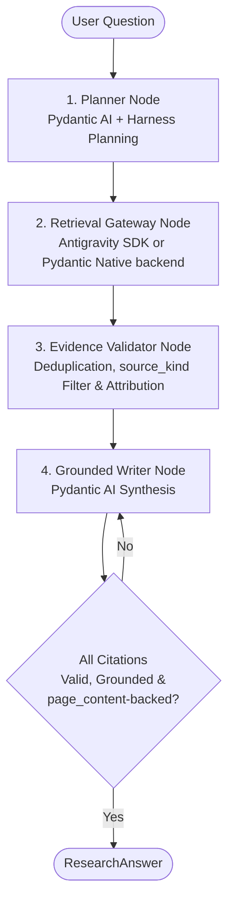

# Pydantic-first Antigravity research architecture

## Summary & Architectural Assessment

Assess and prototype a Pydantic AI research pipeline that uses the Google Antigravity Python SDK (`google-antigravity`) only—never the `agy` CLI—as a tightly sandboxed Google Search and Web Fetch runtime.

**Assessment Verdict**: The design is **viable and recommended, with a configurable retrieval backend**.
The Antigravity SDK is fundamentally agent- and session-oriented (`Agent.chat()` / `Conversation`), communicating over local IPC/Protobuf with the `localharness` runtime binary; it does not provide an ungrounded standalone `search_web()` client RPC — the only entry point is a prompt-driven `agent.chat()` turn. Encapsulating a narrowly configured SDK `Agent` worker as a retrieval gateway inside a host-controlled, typed `pydantic_graph` pipeline achieves deterministic evidence grounding, strict citation verification, and prevents agent drift — subject to the constraints in [Known Constraints & Trust Boundary](#known-constraints--trust-boundary) below, which materially affect budget sizing and what is allowed to be citable.

Retrieval is implemented behind a small `RetrievalGateway` interface (see §1) so the backend is swappable: **Antigravity SDK (default)**, on the assumption that Google's own Search backend and domain-restricted retrieval are more robust/authoritative than a generic provider tool, or **Pydantic AI's native `WebSearch()`/`WebFetch()` capabilities** as a zero-subprocess alternative, useful for environments without `localharness`, for A/B comparison, or as a fallback when the Antigravity binary is unavailable.

---

## Architecture Patterns Evaluated

- **Recommended: Pydantic Pipeline with Swappable Retrieval Gateway.** `pydantic_graph` controls typed stages and state transitions; a small `RetrievalGateway` interface manages retrieval operations behind one of two interchangeable backends (§1). Pydantic AI owns all outer reasoning, schemas, policy enforcement, citation validation, tracing, and final response generation in both cases.
  - **Backend A — Antigravity SDK Gateway (default).** A narrowly configured SDK `Agent` session exposing only `SEARCH_WEB`, `READ_URL_CONTENT`, and `VIEW_FILE`. Chosen as the default because it routes through Google's own Search backend with domain restriction and disk-cached large-page fetching — assumed higher-quality/more authoritative results than a generic provider-native search tool, at the cost of an extra subprocess/IPC hop and the constraints in §"Known Constraints & Trust Boundary".
  - **Backend B — Pydantic AI Native Web Search Gateway.** `capabilities=[WebSearch()]` / `capabilities=[WebFetch()]` (or `NativeTool(WebSearchTool())` for provider-specific config) on a plain Pydantic AI agent. No `localharness` subprocess, no separate SDK dependency, and provider-native search results (e.g. Anthropic/OpenAI grounding metadata) are often already itemized per-source — which can be *more* structured than Antigravity's single `summary` string (see §"Known Constraints"). Recommended as the configured alternative for environments where the Antigravity binary isn't available, for cost/latency-sensitive deployments, or as a benchmark comparator.
- **Single Pydantic Tool-Using Agent.** Lowest initial code complexity, but suffers from weaker separation between query planning, evidence collection, and hallucinated/unsupported claims. Retained only as a baseline comparator.
- **Antigravity Specialist Sub-Agent.** Delegating an entire research task to an autonomous Antigravity subagent with open-ended looping. Rejected for v1: increases token cost, expands the agent loop uncontrollably, and provides less deterministic evidence/citation validation.
- **Dedicated Microservice.** Placing the SDK gateway behind an independent HTTP/gRPC API. Deferred until multi-application usage or independent horizontal scaling justifies process isolation.

---

## Detailed Implementation Design

### 1. Retrieval Gateway Abstraction & Backend Configuration

All retrieval flows through one interface so the outer pipeline is backend-agnostic:

```python
class RetrievalGateway(Protocol):
    async def search(self, query: str, domain: str | None) -> list[EvidenceRecord]: ...
    async def read(self, url: str) -> EvidenceRecord: ...
```

* **Selection**: `ResearchPlan` (or pipeline config) carries `retrieval_backend: Literal["antigravity", "pydantic_native"] = "antigravity"`. The Retrieval Gateway Node (§6) instantiates the corresponding implementation. Defaulting to `"antigravity"` reflects the assumption that Google's Search backend is more robust; `"pydantic_native"` is available as a first-class, tested alternative rather than a rejected option.
* **`AntigravitySDKGateway`** (default) — wraps a sandboxed `Agent` session per §1.1 below.
* **`PydanticNativeSearchGateway`** — a plain `pydantic_ai.Agent` with `capabilities=[WebSearch()]` for `search()` and `capabilities=[WebFetch()]` for `read()`; extracts per-source URL/title/snippet directly from the model's grounding/citation metadata where the provider supplies it, falling back to `raw_extract` as an opaque blob otherwise.
* Both implementations must satisfy the same `EvidenceRecord` contract (§5) and the same `source_kind` distinction (§5) so downstream validation, citation checking, and the Benchmark Comparator (Test Plan) treat them uniformly.

#### 1.1 Inner SDK Worker Configuration & Sandboxing (`AntigravitySDKGateway`)

* **Capability Allowlisting (`CapabilitiesConfig`)**:
  * Set `enabled_tools=[BuiltinTools.SEARCH_WEB, BuiltinTools.READ_URL_CONTENT, BuiltinTools.VIEW_FILE]`.
  * In the Antigravity SDK, `enabled_tools` completely strips non-allowlisted tools (`run_command`, `create_file`, `edit_file`, `list_dir`, `start_subagent`, MCP) from the model prompt context, preventing token waste and eliminating unintended tool invocations.
* **Fail-Closed Safety Policies (`policy`)**:
  * Enforce `policies=[policy.deny_all(), policy.allow("search_web"), policy.allow("read_url_content"), policy.allow("view_file")]` as an additional layer of defense.
* **Operational Budget Limits (`BudgetConfig`)**:
  * `BudgetConfig` limits are **session-scoped**, not per-request. Since one `ResearchPlan` (up to `max_length=5` requests, §5) is batched into a single session (§3), and each request needs at least one model call to decide whether/how to invoke a tool (§"Known Constraints"), size the budget for the whole plan, not one request: `BudgetConfig(max_tool_calls=12, max_model_calls=10)` — comfortably above 5 requests to leave room for a retry or a multi-call search per request. Re-tune from telemetry once the Retrieval Node's drift-check hook (§"Known Constraints") shows real retry rates.
* **Large Page Cache Handling**:
  * `read_url_content` scrapes web pages to Markdown. For large pages exceeding context thresholds, it writes the payload to disk and populates `content_path`. Pairing `BuiltinTools.READ_URL_CONTENT` with `BuiltinTools.VIEW_FILE` allows the model to inspect these cached files safely.

### 2. Evidence Extraction Mechanics

Evidence extraction uses **typed hook interception only** — not `response_schema`-driven synthesis. Forcing the inner worker to paraphrase raw tool output into `EvidenceRecord` JSON via `response_schema`/`FINISH` reintroduces the "ungrounded model prose" problem this design exists to avoid: the host would be trusting the inner model's summary of its own tool calls instead of the tool calls' actual return values. `response_schema` remains available for non-evidentiary uses (e.g. an inner-worker self-report of what it attempted) but must never be the source of a `Citation` or `EvidenceRecord.raw_extract`.

* **Typed Hook Interception (`@post_tool_call`)**:
  * Intercept `types.ToolResult` emitted by the SDK runtime, extracting structured result objects:
    * `SearchWebResult`: `summary` (a single synthesized string of Google Search snippets and sources — **not** a structured per-source list; see `source_kind` below).
    * `ReadUrlContentResult`: `title`, `summary`, and `content_path` (one clean record per URL).
  * The same hook is also the enforcement point for the query/URL drift check described in §"Known Constraints".
* **`source_kind` on every `EvidenceRecord`** (§5) records which tool produced it, because the two tools have different evidentiary quality:
  * `"search_summary"` (from `search_web`): a multi-source narrative blob. Useful for triage/discovery and for the Planner Node deciding what to read next. **Never directly citable** — the `ResearchAnswer` validator (§5) rejects any `Citation` pointing at a `search_summary` record.
  * `"page_content"` (from `read_url_content` or `view_file`): one URL, clean title, extracted text. The only `source_kind` the citation validator accepts.
  * This forces the Planner/Retrieval Nodes toward a search → read two-step for anything that needs to end up in the final answer, which is the intended (and only reliable) path to a citable source given `search_web`'s output shape.

### 3. Session Lifecycle & IPC Optimization

* Initializing `Agent(config)` launches and attaches to the local `localharness` runtime process.
* To avoid repeated subprocess startup overhead, execute batch queries for a given `ResearchPlan` within a **single ephemeral `async with Agent(...)` session context**.
* Requests within that session execute **sequentially, not concurrently**: `Agent.chat()` / `Conversation.send()` are turn-based against shared conversation history, and the SDK does not document support for overlapping concurrent turns on one session. If parallelism is required, use multiple short-lived `Agent` sessions in parallel instead — this trades away the single-session IPC-efficiency benefit, so only do it when latency matters more than subprocess overhead.
* Shared history across requests in one session is usually desirable (later reads can build on earlier search context) but also means token cost compounds across a plan; the Evidence Validator Node should be the place that prunes, not the session itself.

### 4. Error Handling & Gateway Resiliency

* SDK exceptions (`AntigravityConnectionError`, `AntigravityExecutionError`, `ToolExecutionError`, `AntigravityValidationError`) are caught at the gateway boundary and translated into completed `EvidenceRecord(status="failed", error=...)` objects rather than crashing the outer Pydantic pipeline.
* This applies to both backends: `PydanticNativeSearchGateway` catches the corresponding `pydantic_ai` model/tool exceptions and normalizes them to the same `status="failed"` shape, so the Evidence Validator Node (§6) doesn't need backend-specific error handling.

### 5. Typed Data Contracts (`pydantic.BaseModel`)

* `SearchOrFetchRequest`: `request_id: str`, `action: Literal["search", "read"]`, `query_or_url: str`, `domain: str | None = None`.
* `ResearchPlan`: `question: str`, `retrieval_backend: Literal["antigravity", "pydantic_native"] = "antigravity"`, `requests: list[SearchOrFetchRequest] = Field(max_length=5)`.
* `EvidenceRecord`: `evidence_id: str` (e.g. `EVID-001`), `source_url: str`, `source_kind: Literal["search_summary", "page_content"]`, `title: str`, `raw_extract: str`, `timestamp: datetime`, `status: Literal["success", "failed"]`.
* `Claim`: `claim_text: str`, `evidence_ids: list[str] = Field(min_length=1)`.
* `Citation`: `evidence_id: str`, `source_url: str`, `snippet: str`.
* `ResearchAnswer`:
  * Fields: `answer: str`, `claims: list[Claim]`, `citations: list[Citation]`, `limitations: list[str]`.
  * Validator: Pydantic `@model_validator(mode="after")` enforcing that:
    1. every `Citation.evidence_id` and `Claim.evidence_ids` strictly map to valid IDs in the validated `EvidenceRecord` set, and
    2. every `Citation.evidence_id` maps to an `EvidenceRecord` with `source_kind == "page_content"` — a citation resting on a `"search_summary"` record fails validation (§2).

### 6. Host Pipeline Workflow (`pydantic_graph`)



1. **Planner Node**: Generates a bounded `ResearchPlan`, including the `retrieval_backend` choice. Harness `Planning` can be optionally enabled on this node for multi-step question decomposition.
2. **Retrieval Node**: Instantiates the configured `RetrievalGateway` implementation (§1) and executes plan requests **sequentially** (§3) through `search_evidence(query, domain)` and `read_evidence(url)`. For the Antigravity backend, the `@post_tool_call` hook both extracts `ToolResult` and checks the executed `query`/`url` against the requested `query_or_url` (§"Known Constraints"), flagging drift on the resulting `EvidenceRecord`.
3. **Evidence Validator Node**: Normalizes URLs, prunes near-duplicate snippets, assigns stable IDs (`EVID-xxx`), tags `source_kind`, and filters out failed fetches and drift-flagged records.
4. **Writer Node**: Receives *only* the user question and the validated `EvidenceRecord` pool (isolated from general tool execution). The output validator rejects any response citing unprovided evidence IDs or evidence with `source_kind == "search_summary"`.

---

## Known Constraints & Trust Boundary

These follow directly from reading the SDK source (`agent.py`, `tools/tool_runner.py`, `localharness.proto`) rather than only its docs, and should be treated as design constraints, not implementation details:

* **No bypass for the Antigravity backend: retrieval is always LLM-mediated.** `Agent` exposes only `chat(prompt)` — there is no API to force the inner worker to call `search_web(query=X)` with an exact string; `ToolRunner.execute()` only dispatches host-registered custom tools, not the server-side built-ins. A `SearchOrFetchRequest` becomes a prompt, and the inner Gemini model decides whether/how to turn it into a tool call. This is the one place true agent drift can still enter the pipeline, so the `@post_tool_call` drift check (§2, §6) is not optional hardening — it is the mechanism that makes the "deterministic evidence grounding" claim in the Summary actually hold. (The `PydanticNativeSearchGateway` backend has the same property: native web search on any provider is also a model-mediated tool call, not a direct RPC.)
* **`search_web` returns one narrative string, not itemized sources.** `ActionSearchWeb` (`localharness.proto`) is `{query, domain, summary}` — no per-source URL/title list. This is why `EvidenceRecord.source_kind` and the citation validator exist (§2, §5): without them, citation verification would depend on regex-scraping URLs out of LLM-synthesized prose, which is exactly the kind of ungrounded step the architecture is meant to eliminate.
* **Session budgets are plan-scoped, not request-scoped.** See §1.1 for the corrected `BudgetConfig` sizing; the original 3-model-call budget could not have serviced a 5-request plan.
* **One session = sequential retrieval.** See §3. Don't advertise "sequential or concurrent" as a free choice within a single Antigravity session.

---

## Runtime & Environment Requirements

* **Python & Package Management**: Python 3.14 managed via `uv`.
* **Dependencies**: `pydantic>=2.10`, `pydantic-ai`, `pydantic-graph`, `pydantic-ai-harness`. `google-antigravity` is required only when `retrieval_backend="antigravity"` (default); the `"pydantic_native"` backend needs no additional package beyond `pydantic-ai`'s built-in `WebSearch`/`WebFetch` capabilities.
* **Authentication Options**:
  * Google AI Studio: `GEMINI_API_KEY` environment variable.
  * Vertex AI Standard: Application Default Credentials (`gcloud auth application-default login`) with `vertex=True`, `project`, `location`.
  * Vertex AI Express: `vertex=True` with `api_key`.
  * No interactive CLI (`agy`) login flows.
  * `PydanticNativeSearchGateway` uses whatever provider credentials the outer Pydantic AI agent already has configured — no separate auth path.

---

## Test Plan

- **Gateway Unit Tests**:
  - Mock SDK `SearchWebResult` and `ReadUrlContentResult` payloads.
  - Verify allowed tools (`SEARCH_WEB`, `READ_URL_CONTENT`, `VIEW_FILE`) and assert disallowed tools are stripped.
  - Verify graceful translation of SDK connection errors, execution errors, and timeouts to degraded `EvidenceRecord` instances.
  - Verify the `@post_tool_call` drift check: given a requested `query_or_url` and a mismatched executed `ActionSearchWeb.query`/`ActionReadUrlContent.url`, assert the resulting `EvidenceRecord` is flagged and excluded by the Evidence Validator Node.
  - Run the same suite (mocked) against `PydanticNativeSearchGateway` to confirm both backends satisfy the identical `EvidenceRecord`/`source_kind` contract.
- **Contract & Validation Tests**:
  - Test `ResearchAnswer` validator rejection when citations contain unknown `evidence_id`s, hallucinated URLs, or reference a `source_kind == "search_summary"` record.
  - Use `TestModel` / `FunctionModel` to test Planner, Validator, and Writer nodes deterministically.
- **Integration Smoke Tests (External Credentials)**:
  - Execute a live single search query request against both backends.
  - Execute a live search + URL fetch workflow verifying source URL retention and cache handling (Antigravity backend).
  - Assert the final `ResearchAnswer` passes full citation verification against live retrieved evidence, for both backends.
- **Benchmark Comparator**:
  - Compare the Antigravity-backed and Pydantic-native-backed gateways (and, as a baseline, the single Pydantic tool-using agent) across:
    * Citation accuracy and coverage.
    * Unsupported claim rate.
    * Search result quality/authoritativeness (validates or refutes the "Google backend is more robust" assumption behind defaulting to Antigravity).
    * Latency and token consumption (input, output, thinking tokens).
    * Fault recovery resilience.

---

## Assumptions & Boundaries

- Deliverable scope is an architectural design and functional feasibility spike.
- Host application manages claim verification and evidence retention; full raw SDK session transcripts are not persisted to database storage by default.
- Initial pipeline runs requests sequentially within a session (§3); distributed orchestration (e.g. Temporal/Celery) is deferred to future milestones.
- Antigravity is the default retrieval backend on the working assumption that Google's Search backend yields more robust results than generic provider-native search; the Benchmark Comparator (Test Plan) is the mechanism intended to confirm or revise that assumption with data, and `retrieval_backend` is a config toggle, not a one-way architectural door.
